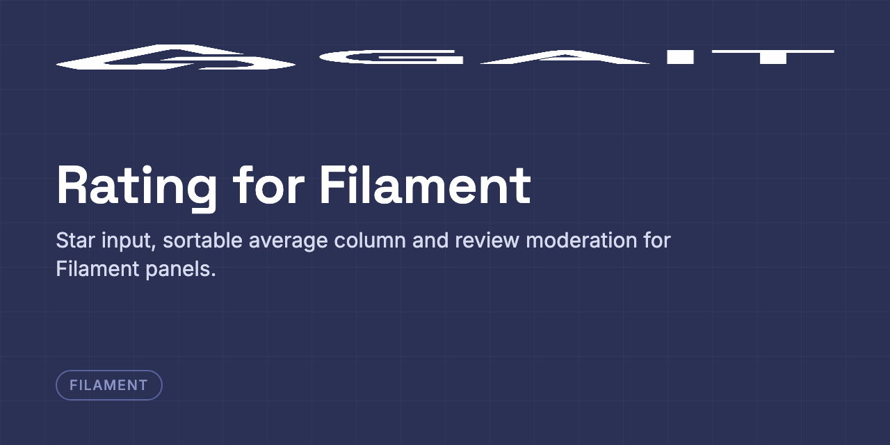

<p align="center"></p>

<p align="center">
  <a href="https://packagist.org/packages/ghanem/rating-filament"></a>
  <a href="https://packagist.org/packages/ghanem/rating-filament"></a>
  <a href="https://github.com/gaitco/rating-filament/actions"></a>
</p>

# Laravel Rating for Filament

Filament 4 & 5 components for [**ghanem/rating**](https://github.com/gaitco/rating)
([Packagist](https://packagist.org/packages/ghanem/rating)) — a star input field, a
sortable average-rating table column, an infolist entry, and a relation manager for
moderating reviews.

This package is admin-panel only. Ratings themselves — the traits, aggregates, scopes,
events and validation — live in
[`ghanem/rating`](https://github.com/gaitco/rating), which is required
automatically. Read its README first if you have not set up the `Ratingable` and
`CanRate` traits yet.

## Installation

```bash
composer require ghanem/rating-filament
php artisan filament:assets
```

> `filament:assets` publishes the star stylesheet into `public/`. **Re-run it after
> every upgrade of this package** — Filament plugins are not compiled by your app's
> Tailwind build, so without it the stars render unstyled.

This pulls in `ghanem/rating` `^2.1`. If you have not already published its migration:

```bash
php artisan vendor:publish --provider="Ghanem\Rating\RatingServiceProvider"
php artisan migrate
```

## Table column

Show a sortable average rating on a resource's table. **The `modifyQueryUsing`
line is required** — it selects the `ratings_avg_rating` alias the column reads,
which is what keeps the table to one query instead of one per row.

```php
use Ghanem\RatingFilament\Tables\Columns\RatingColumn;

public static function table(Table $table): Table
{
    return $table
        ->modifyQueryUsing(fn (Builder $query) => $query->withAvgRating()->withCountRatings())
        ->columns([
            TextColumn::make('title'),
            RatingColumn::make()->showCount(),
        ]);
}
```

Scoping to a rating type happens in the query, not on the column:

```php
->modifyQueryUsing(fn (Builder $query) => $query->withAvgRating('food'))
```

## Form field

```php
use Ghanem\RatingFilament\Forms\Components\RatingInput;

RatingInput::make('rating')
    ->stars(5)
    ->allowHalf()
    ->starColor('#f59e0b')
    ->required();
```

The star count defaults to `config('rating.max')`, and the field attaches
`min`/`max` validation rules from the same config so an out-of-range value
produces a field error instead of an `InvalidRatingException`.

`allowHalf()` lets the field store and render half-point values (`2.5`, `3.5`,
...). Clicking the left half of a star selects the half value, and the star is
drawn half-filled to match.

## Infolist entry

```php
use Ghanem\RatingFilament\Infolists\Components\RatingEntry;

RatingEntry::make('rating')->showValue();
```

## Relation manager

```php
use Ghanem\RatingFilament\Resources\RelationManagers\RatingsRelationManager;

class PostRatingsRelationManager extends RatingsRelationManager {}
```

Then register it on the resource:

```php
public static function getRelations(): array
{
    return [PostRatingsRelationManager::class];
}
```

It lists the ratings a record has **received**, with edit and delete actions for
moderation. There is no create action by default, because the correct author for
an admin-created rating is application-specific.

## Customising the markup

```bash
php artisan vendor:publish --tag=rating-filament-views
```

## Dark mode

The components ship their own stylesheet and follow the panel's theme — filled
stars keep their colour, empty stars darken from `gray-300` to `gray-600` under
Filament's `dark` class. Nothing to configure.

`starColor()` still takes any CSS colour and is applied through a custom
property, so it composes with the theme rather than fighting it:

```php
RatingColumn::make()->starColor('#ef4444')
RatingInput::make('rating')->starColor(fn () => auth()->user()->accent_colour)
```

Both layouts use CSS logical properties, so under `dir="rtl"` the stars fill
from the right edge and half-star selection follows the pointer correctly.

## Translations

English and Arabic ship in the box. Every label, helper text and screen-reader
string resolves through Laravel's translator, so a locale you add is picked up
automatically.

To adjust the bundled strings or add a locale:

```bash
php artisan vendor:publish --tag=rating-filament-translations
```

That writes to `lang/vendor/rating-filament/{locale}/rating-filament.php`.
Translations are welcome as pull requests — copy `resources/lang/en` and keep
the key set identical; a test enforces that every locale stays in step.

## Known limitation

`Ratingable::ratings()` and `CanRate::ratings()` share a method name, so a model
cannot use both traits without resolving the collision with `insteadof`. This
relation manager always means *ratings received*.

## Related packages

- [ghanem/rating](https://github.com/gaitco/rating) — the rating engine this package renders; traits, aggregates, query scopes, events and validation
- [ghanem/friendship](https://github.com/gaitco/friendship) — friendships, requests and blocks for Eloquent models
- [ghanem/friendship-filament](https://github.com/gaitco/friendship-filament) — Filament admin panel for `ghanem/friendship`

## Sponsor

[Become a Sponsor](https://github.com/sponsors/AbdullahGhanem)
